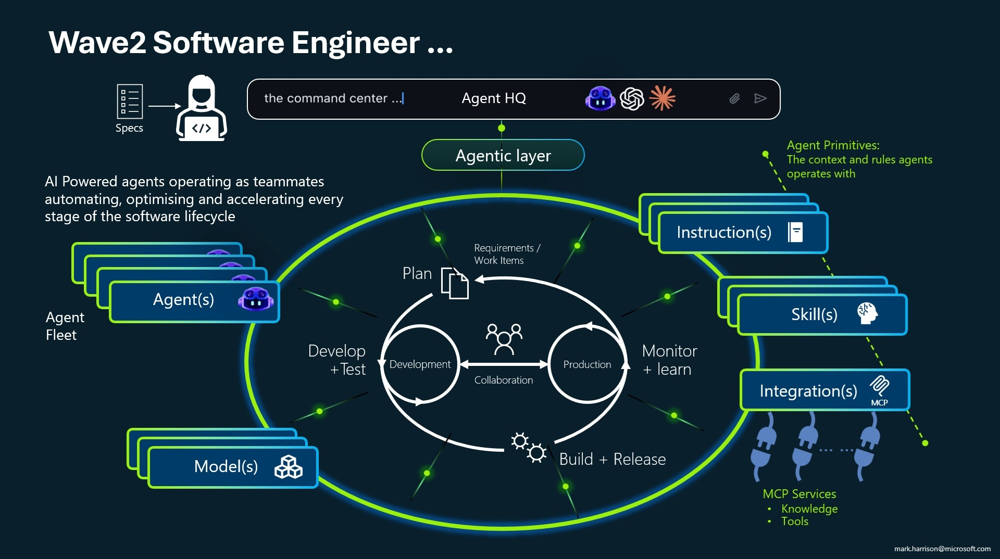
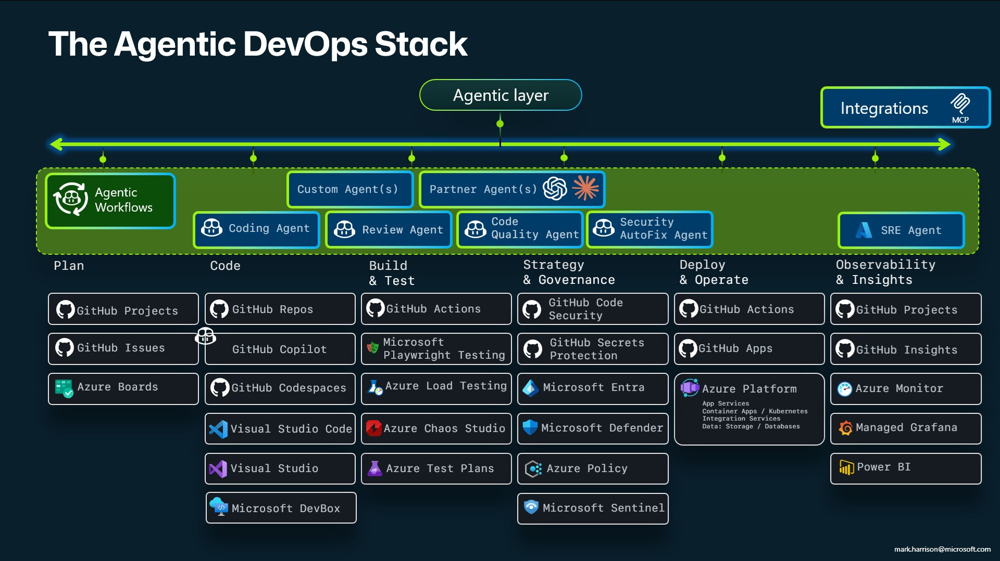

# Overview & Checklist

Welcome to the workshop! This guide will walk you through everything step by step.

## What You'll Build

In this workshop, you will learn how to to build **Github Copilot Custom Agents**.

## Checklist

Before you begin, make sure you have the following:

- Software Installed:
  - VS Code - check you have the latest version
  - Git
  - Node JS
  - Python (recommended - needed for certain Skills)

```powershell
Winget install Microsoft.VisualStudioCode
Winget install Git.Git
Winget install OpenJS.NodeJS.LTS
winget install Python.Python.3.12
```

- GitHub Copilot subscription is active
- Playwright MCP is allowed (enterprise settings can disallow MCP completely or restrict usage to certain MCP services)

## Overview

A custom agent in GitHub Copilot is a user-defined agent described in a `.agent.md` markdown file that you place in your repository. It lets you create specialized, reusable AI assistants tailored to specific tasks or workflows.

A `custom-agent.instructions.md` instructions file enforces good practices for the agent definition. Key characteristics include:

- Defined in markdown - includes YAML frontmatter (name, description, model, tools) followed by a markdown body that defines the agent's behavior, constraints, and workflow.

- Three agent types:
  - Agent - A self-contained assistant that does one job end-to-end.
  - Orchestrator - Coordinates a multi-step pipeline by delegating to subagents, with approval gates between steps.
  - Subagent - A specialist that handles one step in an orchestrator's pipeline; never invoked directly by users.

- Configurable tools & models - You specify which tools (file read/edit, search, terminal, web, MCP servers) and which AI model the agent should use.

- State tracking - Agents write state/progress files so work can be resumed, reviewed, or reverted.

## Workshop Structure

| Lab | Title                                  | Description                                                                                                        | Duration |
| --- | -------------------------------------- | ------------------------------------------------------------------------------------------------------------------ | -------- |
| 1   | Build a Bio Agent                      | Create your first custom agent — a single-agent professional biography writer.                                     | 30 min   |
| 2   | Build a Multi-Agent Incident Reporter  | Build an Orchestrator + Subagent pipeline that analyses raw incident notes and produces a styled HTML report.      | 30 min   |
| 3   | Build a Proposal Agent                 | Build a custom agent that uses skills — generates business proposals as PowerPoint or HTML.                        | 30 min   |
| 4   | Build a Tech News Agent                | Build a news aggregation agent that uses MCP servers — integrates Playwright MCP for web scraping.                 | 30 min   |

## Slides

### The Wave 2 Software Engineer



GitHub Copilot provides the following customization primitives. Each serves a distinct purpose and loads at different points in your workflow:

| Primitive                        | Location                                                       | Purpose                                                      |
| -------------------------------- | -------------------------------------------------------------- | ------------------------------------------------------------ |
| **Always-on Instructions**       | `.github/copilot-instructions.md`, `AGENTS.md`, or `CLAUDE.md` | Global rules applied to every Copilot request                |
| **File-based Instructions**      | `.github/instructions/*.instructions.md`                       | Rules that activate when working with specific file patterns |
| **Prompts**                      | `.github/prompts/*.prompt.md`                                  | Reusable task templates invoked as slash commands            |
| **Skills**                       | `.github/skills/*/SKILL.md`                                    | Procedural knowledge Copilot can discover and apply          |
| **Custom Agents**                | `.github/agents/*.md`                                          | Specialized AI personas with defined behaviors               |
| **MCP (Model Context Protocol)** | `.vscode/mcp.json`                                             | Connections to external tools, APIs, and data sources        |

### The Agentic DevOps stack



Ready? Let's go!

👉 **Continue to [Bio Agent](01-bio.md)**
